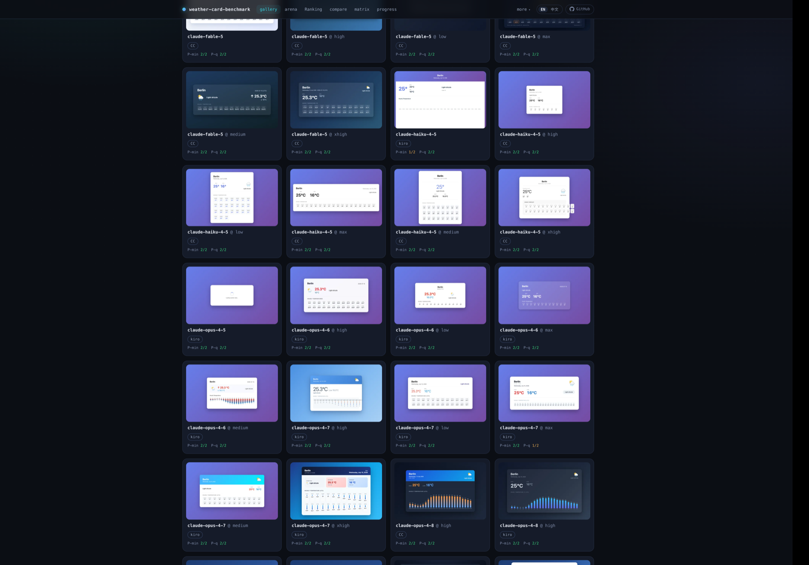
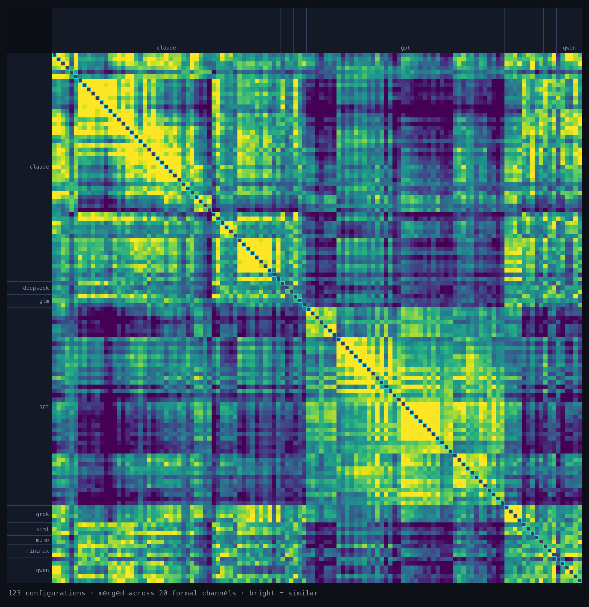

<div align="center">



# weather-card-benchmark

**同一道题,喂给每一个前沿模型 —— 它们造出来的东西差多少?**

[**▶ 打开在线站点**](https://weathercard.secondfirst.ai) &nbsp;·&nbsp;
[我们发现了什么](#我们发现了什么) &nbsp;·&nbsp;
[自己跑一遍](#自己跑一遍) &nbsp;·&nbsp;
[数据](#数据) &nbsp;·&nbsp;
MIT

[English](README.md) &nbsp;·&nbsp; **中文**

<a href="https://buymeacoffee.com/2nd1st"></a>

</div>

---

每个模型拿到*完全相同*的 prompt 和*完全相同*的冻结天气数据,只被要求做一件事:一张自包含的 HTML **weather card**。每张卡在**完全一致**的条件下 headless 渲染并截图,然后每一对结果在 **22 条视觉与结构相似度通道**上打分。

结果是一张地图 —— 今天最强的模型们在一道明确定义的、one-shot 前端任务上,哪里**收敛**、哪里**分化**;以及*同一个*模型跨不同 coding harness/CLI、不同 reasoning-effort 档位时,会怎么变。

上面那些是真实的卡:同一份 Berlin 天气,设计天差地别。

## 我们发现了什么

构建数据集过程中的描述性测量 —— 是信号,不是定论(单一 prompt 家族、小 N)。每一条都能在站点上回溯到产生它的原始数据。

- **同一个模型,经不同 harness 会画出不同的卡。** harness 本身是一条独立的能力轴,不是中立的管道。
- **effort 能把输出体积翻好几倍 —— 某个模型上高达 14×。** 更多"思考"不是多写一点代码,可能是多一个数量级。
- **在有些模型上,effort 旋钮测不出任何区别。** 参数被接受,输出纹丝不动。
- **官方 GPT API 上根本没有 `minimal` 档** —— 而 **`max` 是 gpt-5.6 家族独有的**。effort 梯子每家不同,且到处是洞。
- **官方 API 的输出比同一模型走 proxy 通道大 5–8×。**
- **kimi-k3 在 qualitative prompt 变体上花的"思考"约是 minimal 变体的 10×。**

## 这张地图

<div align="center">

</div>

每个被测 configuration 对上其余每一个,跨所有通道合并。亮 = 相似,暗 = 分化。对角线上的亮块是各**模型家族**在自我聚类;那条细亮对角线是每个 config 的**自一致性**(一个模型和它*自己*重跑之间有多像)。这里的相似度是**测量,不是质量分** —— 它只刻画收敛,别无其他。

### 从矩阵里才看得到的

有些东西只在这里现形。下面的数字都是 `P-min` 集上、跨 **20 条正式通道**的 merged **共识分** —— **是信号,不是证明**(单一 prompt 家族、小 N),而且有两个混淆项贯穿始终:低 effort 的卡会向一个通用基线收敛,共享的 harness(opencode / Kiro / Qoder)本身也会带进脚手架。请据此理解。

> **这个数是什么。** 通道之间量纲不可比 —— `c-winnow` 的跨对中位数是 0.22,`x-semantics` 是 0.95 —— 所以直接平均,结果基本上等于"谁的方差大就听谁的"。因此每条通道先按它在全集上的 p1–p99 拉伸,再取平均,让每条通道票权相等。拉伸区间是**冻结**在已发布数据里的,所以这里的数字和线上矩阵显示的是同一个数,筛选视图也不会让它变。**共识分不是相似度百分比**:0.50 的意思是"在这个语料里属于中游",不是"像了一半"。

- **家族是真实的分组,而且比我们最初发布的更强。** 一个 config 和自己重跑最像(自一致性 **0.745**),和自家家族次之(**0.583**),和别家最不像(**0.500**)。本表的早期版本写的是 0.72 / 0.63 / 0.59 并称"差距很小" —— 那是**直接平均原始通道值**造成的假象:那些对*任何*配对都给出 0.95 左右的通道,相当于给所有人加了一个常数,把差距压平了。仍然成立的是:一个模型低 effort 的卡,可能比它自己高 effort 的卡更像别家。
- **家族信号几乎全在代码里,不在像素里。** 按通道族拆开看,`c-merged` 区分同族/跨族的 AUC 是 **0.769**,`x-merged` 是 **0.737**,而 `v-merged` 只有 **0.585** —— 单看 `v-ssim` 更是 **0.482**,低于随机。模型继承的是*写代码的门派手法*;卡片最后*长什么样*,各家反而收敛得多。
- **满血 frontier Claude 是全局离群点。** `claude-opus-5 @max`(**0.425**)、`claude-fable-5 @max`(**0.482**)和 `claude-opus-4.8 @max`(**0.512**)离*其余 Claude* 比 Claude 家族自身的平均(**0.582**)还要远 —— 离别家也更远;`claude-opus-5 @xhigh`(**0.477**)也落在同一区间。最强的模型开到满 effort,去了一个连它自家同门都不跟去的地方。这是 P-min 上的陈述:在 `P-q` 集上这些仍低于家族均值(那里是 **0.554**),但它们**彼此之间的排序会变** —— 领跑离群的换成了 `claude-sonnet-5 @max`。
- **高 effort 把老 Opus 推离家族 —— 4.7 上很清楚,4.6 上很勉强。** `opus-4.7` 在 **xhigh**(**0.577**)和 **high**(**0.605**)档漂离 Claude 簇,而 medium 档是 **0.665**。`opus-4.6` 方向一致但差距在噪声范围内(high **0.600** vs medium **0.616**),所以这应当读作**某一个模型**的现象,而不是这一代的。effort 改变的是模型*落在设计空间的哪里*,不只是写多少。
- **grok 谁都像一点;GPT 谁都不像。** 在样本充足的家族里,grok 的跨家族触达最高(**0.531**),GPT 最低(**0.469**)—— GPT 的卡是全场最我行我素的。另有两个只有单个 config 的家族更低(`north` **0.302**、`opencode` **0.472**),但各自只有 200 个配对,太薄,不下结论。
- **有些模型和自己都不像。** `deepseek-v4-flash`(**0.488**)、`kimi-k2.6`(**0.492**)和 `kimi-k2.7-code`(**0.558**)自一致性最低 —— 多数重跑画得都不一样;别的模型确定性强得多。注意:**全集只有 20 个模型(56 个 config)拿得到自一致性读数** —— 它需要同一 config 在同一变体下有足够多次重跑,而 CLI harness 各臂跑得太少,估计值不够格。
- **厂商在固定型号名下换掉了模型,而我们基本测不出来。** DeepSeek 于 2026-07-31 对 `deepseek-v4-flash` 重做了 post-training,API 型号名不变(官方原话:架构与参数量不变,"only re-post-trained")。我们手上有一份 **2026-07-19** 的采集,正好在更新之前,于是两个纪元并排留在集合里。拿它们对照**各自的重跑噪声**:在 `P-min` 的 `high` 档,两个纪元之间只有 **0.529**,比它们自一致性中较低的那个(0.728 / 0.683)还低 **0.154** —— 差不多相当于两个*不同的* DeepSeek 模型之间的距离(0.565)。但另外三格(P-min `max`、P-q `max`)都落在重跑噪声之内,而 P-q `high` 干脆没有读数(只剩 3 个有效 slot,不过 n_eff 门槛)。**四格里只有一格。** 原因是结构性的:这个模型的自一致性是全场最差的几个之一(**0.488**),它自己的重跑方差和我们想看的变化是同一个量级。**这应当读作仪器的分辨率下限,而不是"模型变了/没变"的证据** —— 在 N=4 下我们分辨不出来。旧卡从未重跑、也未被覆盖;新纪元是独立席位。

## 这是什么

**任务。** 两个 prompt 变体 —— `P-min`(极简)和 `P-q`(充分)—— 都喂同一份冻结天气快照,所以结果不依赖于何时何地跑。逐字 prompt 在 [`prompts/`](prompts/)。每个模型每个变体跑 `N` 次;一张卡必须渲染出非平凡、合规的内容才计入。

**三条轴。** 每个 configuration 是三条轴上的一个点:

- **model** —— 前沿模型(Claude、GPT、Gemini、Qwen、GLM、Kimi、DeepSeek、Grok、Doubao、MiMo、MiniMax …)
- **harness** —— 怎么驱动它:官方 API,或一个 coding CLI/harness(Claude Code、Codex、Qoder、opencode、Kiro、grok-cli …)
- **effort** —— reasoning-effort / thinking 档位,如果模型暴露这个旋钮

## 在线探索

在 **[weathercard.secondfirst.ai](https://weathercard.secondfirst.ai):**

| | |
|---|---|
| **Gallery** | 每一张卡,可筛选 —— 原始输出 |
| **Matrix** | 完整的 config × config 相似度热力图(即上图) |
| **Compare** | 任意一组模型并排,同 prompt、同数据 |
| **Arena** | 盲选 A/B —— 挑你更想看的那张,身份投票前隐藏 |
| **Methodology** | 22 条通道,以及一张卡如何算合格 |

## 自己跑一遍

**Runner**(Python 3.11+)—— sample → render → similarity:

```bash
python3 -m venv .venv
.venv/bin/python -m pip install -U pip
.venv/bin/python -m pip install requests playwright pytest pyyaml jsonschema rfc8785
.venv/bin/python -m playwright install chromium

cp runner/.env.example runner/.env   # 填 key + WCB_API_BASE
cd runner && ../.venv/bin/python -m pytest -q
```

`runner/.env` 存你的 key,已 gitignore —— 绝不能提交。config YAML 里的 `credential_ref` 是环境变量*名字*,永远不是密钥值。

**Site**(Node)—— gallery / matrix / compare / methodology:

```bash
cd site && npm install && npm run dev   # http://localhost:3000
```

站点从 `WCB_DATA_ROOT` 解析数据根(默认用仓库内的 `data/batches`)。部署自己的 fork 时,把 `NEXT_PUBLIC_SITE_URL` 设成你自己的域名。

## 数据

完整测量集很大(200+ configurations × 多个 slot × 截图),所以仓库只带一份**旗舰子集** —— 每个前沿实验室一个 canonical configuration —— 放在 [`data/batches/`](data/batches/)。站点开箱即用地渲染它。

**完整集**可在线浏览,也能作为单个 pack 下载:

- **完整数据集** → <https://weathercard.secondfirst.ai/downloads/wcb-full-dataset-2026-07-31.tar.gz>
  (~481 MB)。解压出 `2026-07-19--unified/` + `index.json`;把 `WCB_DATA_ROOT` 指向解压目录即可在本地跑整套。

## 目录

```
runner/     Python 流水线:adapters(各厂 API/CLI)· render · similarity · tests
site/       Next.js 站点:gallery / matrix / compare / methodology
data/       SCHEMA(冻结 JSON Schema)· batches(旗舰子集)
prompts/    两份逐字任务 prompt
```

## 帮忙扩大覆盖

这是一个人持续在跑的 sweep,而前沿每周都在动。可以这样帮忙:

- **贡献一次 run。** 站点的 **Contribute** 流程会接收你在本地生成的一张卡,用同样的方式渲染、打分,并并入数据集。
- **指出一个缺口。** 缺某个 model、某个 harness、某个 effort 档?开一个 [issue](https://github.com/2nd1st/weather-card-benchmark/issues) —— 站点上的 coverage 视图记录了已覆盖和计划中的内容。
- **借出访问权。** 如果你手上有尚未覆盖的 model 或 harness 的账号 / API 访问权,并且愿意让它跑这个 benchmark —— 开一个 issue,我们私下约一个渠道对接。**绝不要在公开处(issue、PR、评论,任何地方)贴出 key、token 或 cookie**,我也永远不会这样问你要。密钥只走你自己掌控的私密渠道。
- **赞助一次 run。** 每个 configuration 都是真金白银的 API 和订阅开销。一杯咖啡 [buymeacoffee.com/2nd1st](https://buymeacoffee.com/2nd1st) 会直接变成更多模型、更勤的重跑。

## 许可

MIT —— 见 [LICENSE](LICENSE)。
